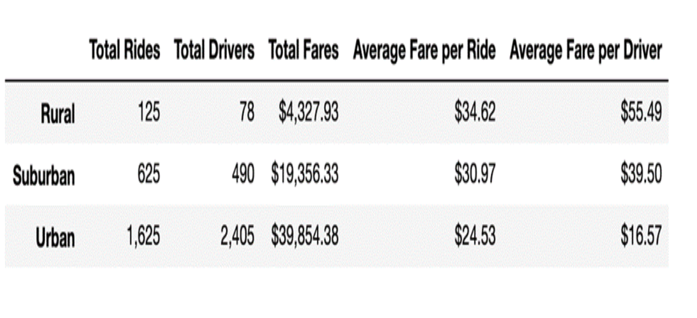
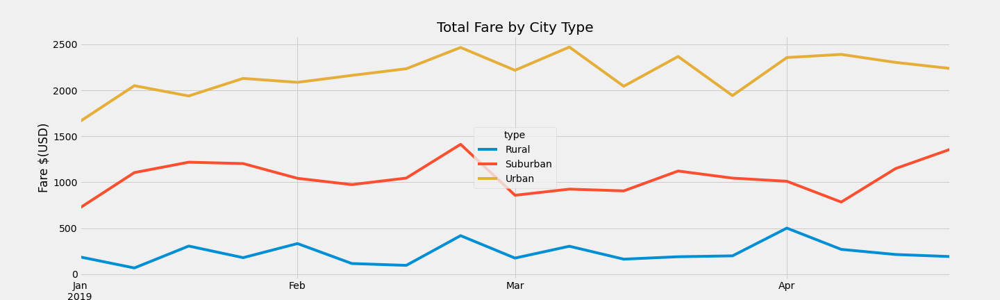

# PyBer With Matplotlib

## Overview of the analysis:

The purpose of the analysis is to provide V. Isualize with information about how the total weekly fares differ by city type and show how those differences can drive decision making by PyBer management. 

## Result:

 

### Total Rides : 
The numbers of rides increase as we are moving from Rural to Urban cities, with urban cities accounting for almost 70% of the total rides.

### Total Drivers : 
The number of drivers increase as we are moving from Rural to Urban cities. 80% of Pyber drivers are operating in Urban cities against only 3% operating in Rural cities.

### Total Fares : 
93% of revenue are generated by Suburban and Urban cities, contributing at respectively 30% and 63% of the total revenue. Rural cities account only for 7% of total revenue.

### Average Fare per ride : 
On the opposite of total fares, as we are moving from Rural to Urban cities, the average fare per ride drops from 34.62$ to 24.53$. Which means rides in rural cities are more profitable.

### Average Fare per Driver : 
As we are moving from Rural to Urban cities, the average fare per driver drops significantly from 55.49$ to 16.57$. Which means a driver in the rural area is far more profitable than a driver in the urban area.

### Total fare by city type by week : 

 

Within the same city type, the total fare is not consistent week over week, with differences going from 50$ to 500$ for Rural cities, from 600$ to 1,400$ for Suburban cities, and from 1,600$ to up to 2,500$ in Urban cities. As we are moving from Rural to Urban cities those disparities in total fares per week go wider.

## Summary: 

- Urban cities seem to be saturated by drivers. It would be more profitable to review the number of drivers on Urban cities, and maybe to reallocate drivers from Urban to Rural and Suburban cities, to increase profitability as the average fare /driver in Rural and Suburban cities are much above average. 

- Review the fare policy among cities to make sure it is adapted to the local market, and to make the Byper services more attractive on Rural and suburban cities.

- Suggest some incentives to drive consistent usage and avoid having such disparities on revenues from week to week (Example: put in place a reward program per number of rides…)
